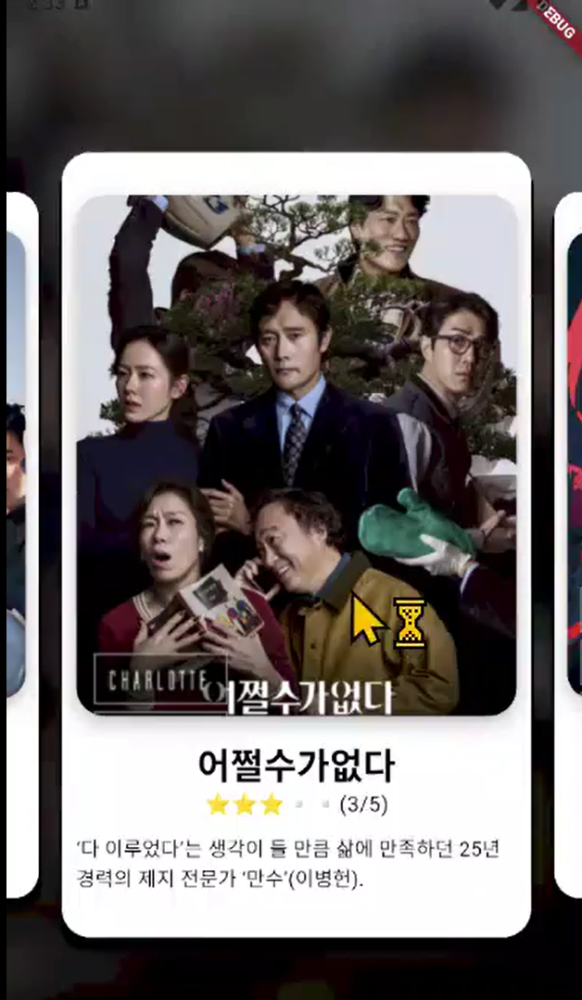
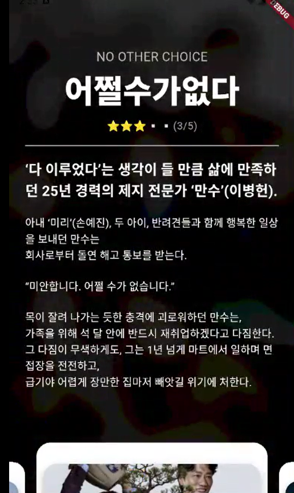

# 🎬 Interactive Movie App

> Flutter 애니메이션을 활용한 인터랙티브 영화 카드 슬라이더 앱

Flutter 10주 스터디 졸업 과제

---

## 📌 프로젝트 소개

스와이프와 드래그 제스처에 반응하는 인터랙티브한 영화 정보 앱입니다.  
카드 형태의 영화 포스터를 좌우로 넘기며 탐색하고,  
아래로 드래그하면 상세 정보가 애니메이션과 함께 펼쳐지는 UI를 구현했습니다.

---

## 🛠️ 기술 스택

| 분류 | 기술 |
|:---|:---|
| **Language** | Dart |
| **Framework** | Flutter |
| **패키지** | `flutter_animate` |

---

## 🎯 핵심 기능 & 사용 기술

### 1. 카드 캐러셀 (PageView)
- `PageView.builder` + `viewportFraction: 0.8`로 양옆 카드가 살짝 보이는 캐러셀 구현
- `ValueListenableBuilder`로 스크롤 위치를 실시간 감지하여, 현재 카드는 크게 / 양옆 카드는 작게 표시되는 **스케일 애니메이션** 적용

### 2. 배경 블러 & 전환 효과
- `BackdropFilter` + `ImageFilter.blur`로 현재 선택된 영화 포스터가 배경에 블러 처리되어 표시
- `AnimatedSwitcher`로 페이지 전환 시 배경 이미지가 자연스럽게 크로스페이드

### 3. 제스처 기반 상세 정보 화면
- `GestureDetector`의 `onVerticalDragUpdate`로 드래그 방향 감지
- **아래로 드래그** → 카드가 하단으로 밀려나며(`AnimatedSlide`) 상세 정보 등장
- **위로 드래그** → 상세 정보가 닫히고 카드 뷰로 복귀
- `flutter_animate` 패키지의 `slideY`로 상세 화면 슬라이드 인 애니메이션 구현

### 4. 동적 오버레이
- `AnimatedContainer`로 드래그 상태에 따라 배경 어둡기를 `0.5 → 0.8`로 자연스럽게 전환
- `Stack` 기반 레이아웃으로 배경, 카드, 상세 화면을 레이어링

---

## 📸 스크린샷

- 시연 영상 : https://imgur.com/a/dNrkfcb

  
  
  

---

## 📝 배운 점

- `PageView`의 `viewportFraction`과 `ValueListenableBuilder`를 조합한 스크롤 연동 스케일 애니메이션 구현
- `AnimatedSwitcher`, `AnimatedSlide`, `AnimatedContainer` 등 Flutter의 암시적 애니메이션 위젯 활용법
- `GestureDetector`를 통한 드래그 방향 감지와 이를 UI 상태 전환에 연결하는 설계
- `BackdropFilter`로 배경 블러 처리 시 성능과 시각적 효과의 균형 잡기

---

## 📎 관련 프로젝트

| 졸업 과제 | 설명 | 링크 |
|---|---|:---:|
| **Interactive Movie** | 애니메이션 기반 인터랙티브 UI (현재) | - |
| **Any Movie** | 외부 API 연동 영화 앱 | [Repo](https://github.com/WAcAW9/2025_FlutterChallenge_MovieApp) |
| **MoodTracker** | Firebase 인증 + DB 감정 기록 앱 | [Repo](https://github.com/WAcAW9/2025_FlutterChallenge_MoodTracker) |
